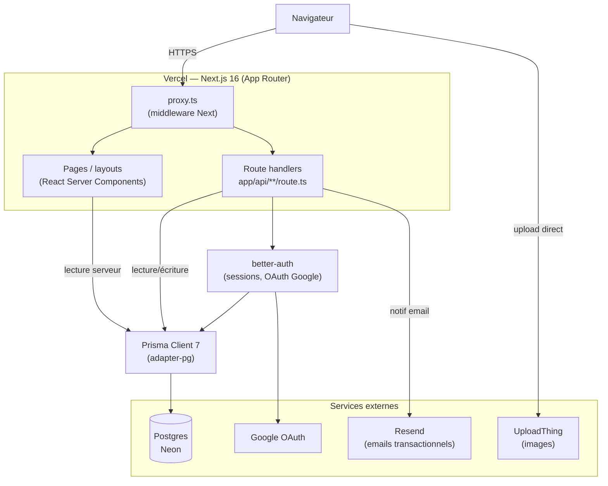

# Architecture

## Vue d'ensemble

## Couches

### Présentation — App Router (`app/`)
Découpage par groupes de routes : `(auth)` (login/register/role-selection, layout minimal sans navigation), `(app)` (toutes les pages authentifiées ou publiques du produit : artistes, réservations, messagerie, dashboard), `(admin)` (vérification des profils artistes). Les pages sont des **React Server Components** par défaut — la donnée est lue directement via Prisma côté serveur (pas de fetch client vers une API pour l'affichage initial), avec `"use client"` uniquement sur les composants interactifs (formulaires, filtres, sheets).

### API — Route handlers (`app/api/`)
Utilisés pour les **mutations** déclenchées depuis le client (créer une réservation, uploader un tatouage, suivre un artiste...) et pour le endpoint catch-all de better-auth. Chaque route valide son entrée avec un schéma **Zod** dédié (`lib/validation/`) avant tout accès base de données, et vérifie l'autorisation (rôle, propriété de la ressource) avant lecture/écriture — voir l'audit du ticket #88 pour `/api/bookings`.

### Accès aux données — Prisma 7 + `@prisma/adapter-pg`
Le générateur `prisma-client` (mode ESM natif, sans moteur binaire séparé) est utilisé avec l'adapter `pg`, qui pilote directement le driver `pg` vers Postgres plutôt que de passer par le moteur Rust historique de Prisma — plus léger à déployer sur Vercel (pas de binaire natif à embarquer) et compatible avec le pooling de connexions de Neon.

### Authentification — better-auth
Choisi plutôt qu'un service SaaS (Auth0, Clerk...) pour rester auto-hébergé sur la même base Postgres (tables `Session`/`Account`/`Verification` dans le même schéma Prisma, pas de synchronisation externe) et pour son support natif des champs additionnels (`role` sur `User`) et des hooks de cycle de vie (`databaseHooks.user.create.after`, qui crée automatiquement le profil `TattooArtist` à l'inscription d'un artiste). Email/mot de passe et OAuth Google sont supportés nativement.

### Services externes
- **UploadThing** : upload d'images (avatar, œuvres, pièces jointes de messages) directement depuis le navigateur vers un stockage géré, sans faire transiter les fichiers par le serveur Next.js. Évite d'opérer soi-même un bucket S3/R2.
- **Resend** : envoi des emails transactionnels (nouvelle demande de réservation, confirmation, refus, profil approuvé/rejeté) via `lib/email.ts`, appelés en fire-and-forget (`void sendXxxEmail(...)`) pour ne pas bloquer la réponse HTTP sur la latence d'un fournisseur tiers.

### UI — Tailwind 4 + shadcn/radix
Composants Radix UI (non stylés, accessibles par défaut — focus trap, aria, clavier) habillés avec Tailwind et la couche `components/ui/` générée par shadcn. `components/custom/Typography` centralise l'échelle typographique et les couleurs sémantiques (`--color-primary`, `--color-muted`...) définies dans `app/globals.css`, pour que light/dark mode et la charte visuelle restent cohérents sans dupliquer de classes dans chaque composant.

## Tests et intégration continue

- **Vitest** pour la logique pure (schémas Zod, helpers de dates/tarifs) — rapide, aucune dépendance base de données (voir `lib/validation/*.test.ts`, `lib/availability.test.ts`).
- **Playwright** pour le parcours critique de bout en bout (inscription → recherche → réservation), contre une vraie base Postgres.
- **GitHub Actions** (`.github/workflows/ci.yml`) : `lint`/`typecheck`/`test` sur chaque pull request, `e2e` (avec un Postgres de service jetable) uniquement sur push vers `main`, pour garder les PR rapides tout en validant le parcours complet avant chaque mise à jour de la branche de référence.

## Déploiement

Application déployée sur **Vercel** (build Next.js standard), base de données sur **Neon** (Postgres serverless, compatible avec le pooling nécessaire en environnement serverless). Les migrations Prisma (`prisma/migrations/`) sont appliquées manuellement via `prisma migrate deploy` avant chaque mise en production (pas encore automatisé dans le pipeline CI — piste d'amélioration notée dans `docs/veille.md`).
